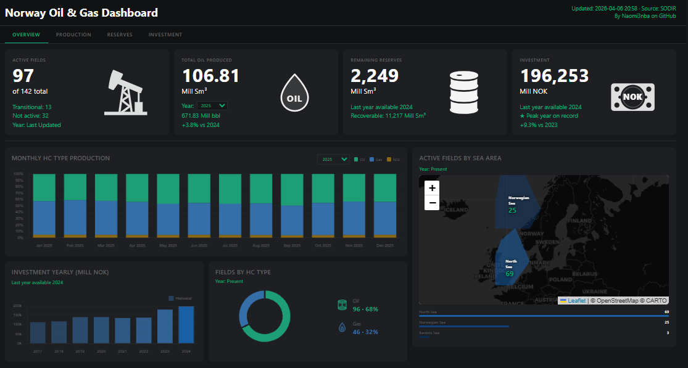
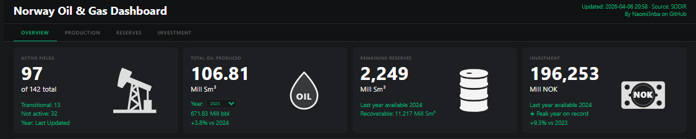
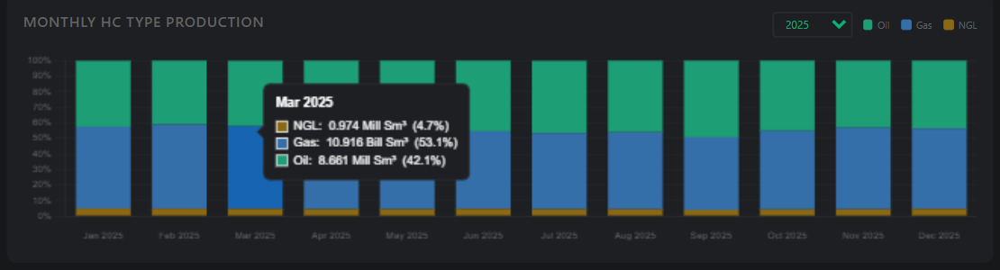
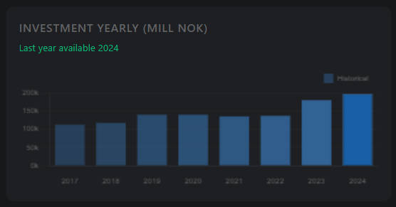
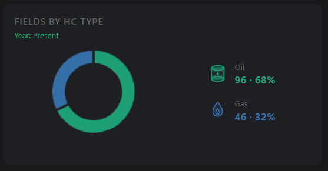
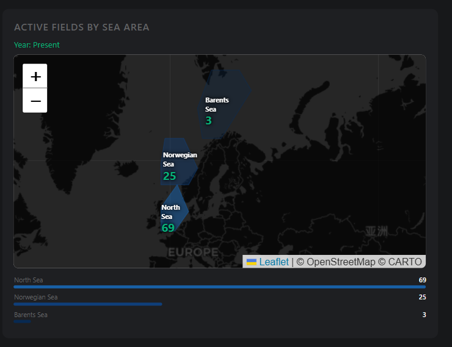
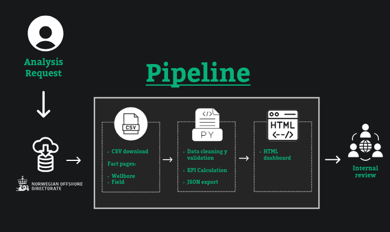

# Norway Oil & Gas Dashboard

An automated end-to-end data pipeline and interactive dashboard built with Python and public data from SODIR (Norwegian Offshore Directorate).

**Live Dashboard →** [naomi3nba.github.io/norway-oil-gas-dashboard](https://naomi3nba.github.io/norway-oil-gas-dashboard)



## The Questions Behind This Project

Living in Oslo and studying the Norwegian energy sector, I wanted to answer some concrete questions using real public data:

MAIN QUESTION: 

- **What are the best ways to automatically track and visualize Norway's oil production trends?**

Secundary Questions: 

- **How many oil fields are currently active on the Norwegian Continental Shelf?**
- **Is Norway's offshore investment growing or declining?**
- **How much oil has Norway already extracted vs what remains underground?**
- **What is the production mix — how much is oil, gas, and NGL?**
- **Which sea area concentrates the most active fields?**

These questions led me to build a fully automated pipeline — from raw SODIR data to a live interactive dashboard.

---

## Overview

The dashboard provides a real-time snapshot of Norway's offshore oil and gas sector, covering production, reserves, and investment across all active fields on the Norwegian Continental Shelf.

---

## Data Source

All data is sourced from **SODIR — Norwegian Offshore Directorate** (factpages.sodir.no), updated automatically via the pipeline.

---

## KPIs


**Active Fields**
Current operational status of all 142 registered fields on the Norwegian Continental Shelf. Shows fields classified as Producing (97), Transitional/Approved for production (13), and Shut down (32). This is a live snapshot — not dependent on year selection.

**Total Oil Produced**
Annual oil production in Mill Sm³ for the selected year. Includes conversion to Mill bbl and percentage change vs the previous year. Default year is 2025 — the last complete year available in the dataset.

**Remaining Reserves**
Total remaining recoverable oil equivalent (OE) across all fields, expressed in Mill Sm³. Based on the latest reserve estimate available (December 2024). Also shows total recoverable OE for reference.

**Investment**
Total capital investment in Mill NOK for the last reported year (2024). Includes percentage change vs the previous year and highlights whether it represents a peak year on record. Note: 2025 investment data is not yet available from SODIR.

---

## Charts

**Monthly HC Type Production**
Stacked bar chart showing the monthly production mix of Oil, Gas, and NGL for the selected year. Each bar represents one month — the proportional split between hydrocarbon types is displayed as a percentage. Hovering over any bar shows the exact values in Mill Sm³ (Oil/NGL) and Bill Sm³ (Gas). For incomplete years, the chart shows the last available months.



**Investment Yearly (Mill NOK)**

Bar chart showing historical capital investment from 2017 to 2024. Bar intensity increases progressively toward the most recent year. The 2024 bar is highlighted as the peak year on record. Investment data for 2025 is not yet available.



**Fields by HC Type**

Donut chart showing the distribution of fields by hydrocarbon classification — Oil (68%, 96 fields) and Gas (32%, 46 fields). This reflects the current classification of all active and inactive fields and does not change with year selection.



**Active Fields by Sea Area**
Interactive map (Leaflet.js) showing the three main offshore areas of Norway, colored by intensity according to number of active fields — North Sea (69 fields), Norwegian Sea (25 fields), and Barents Sea (3 fields). The map reflects current field status and is not affected by year selection.



## How to Get Updated Data

To refresh with the latest SODIR data:

```bash
python pipeline.py
```

This downloads fresh data from SODIR, cleans it, recalculates all KPIs, and updates the JSON in approximately 35 seconds.

---

## Pipeline



## Tech Stack

| Tool | Purpose |
|---|---|
| Python | Data pipeline |
| Pandas | Data cleaning and transformation |
| Chart.js | Interactive charts |
| Leaflet.js | Interactive map |
| HTML/CSS/JS | Dashboard frontend |
| GitHub Pages | Deployment |

---

## Author
**Naomi Barranzuela** — Junior Data Analyst

Oslo, Norway 
· [GitHub](https://github.com/Naomi3nba) ·
[LinkedIn](https://www.linkedin.com/in/naomiba/)